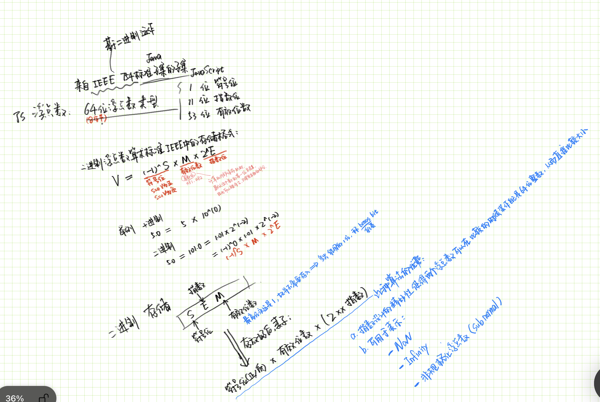

> 图书地址：https://weread.qq.com/web/reader/27132c50725b7002271d9adk45c322601945c48cce2e120

# 看的时候觉得看完需要去做的事情

 - 阅读 ECMAScript规范 ---  发现JavaScript的绝妙之处。

# 01 命名

- 实际上，JavaScript命名还能以Unicode字符开头和结尾。——译者注
- 下划线前缀/后缀 ---  一般表示似有变量
- 美元符号       --- 通常是被一些代码生成器、转义器和宏处理器加到变量里的，以此来保证生成的变量名不会与人工编写的代码冲突
- 数字           --- 以数字结尾的名字通常是程序员因起名而头大的表现。

- 推荐你使用下划线分隔变量名中的多个单词

- 所有的构造函数都应该以大写字母开头，而其他任何名字都应该以小写字母开头 --- 光从表面上看，构造函数和普通函数并没有什么区别

# 02 数值

- 计算机是操纵数的机器，而且溯其本质，计算机只能操纵数。还别说，它干这类活儿的确是把好手。人类要做的就只是把其他信息映射为数。人类几乎所有的活动都能借助计算机完成。
- JavaScript中的数都是实数（real number），不过是“假”的实数。 ----**<font color=red>如何‘假’了</font>**-----》
- JavaScript不像其他语言一样有整型、浮点型等数值类型，而是只有一个总称，叫数值类型（number）。该实现借用自**IEEE 754**标准，一种为英特尔iAPX-432处理器设计的标准。优秀理念：432的浮点运算单元，流传到了8086的数学协处理器（math co-processor）8087上，现在已成为了奔腾及AMD64芯片上的标准。  ------作者观点：◊--  JavaScript最成功的设计之一：这个设计让程序员不必浪费时间在几种相似的数据类型之间做选择，毕竟有时候花了时间还会选错；能避免那些由于数据类型之间的转换而造成的错误；甚至还可以避免整数类型的溢出错误。JavaScript的“整数”可比Java的整数可靠多了，因为它们不会溢出。
- JavaScript的number类型： 64位的浮点数类型。一个number类型包含1位符号位（sign）、11位指数位以及53位有效位数。有些神奇的编码能将65位数据装进64位内存中。

> [关于 IEEE 754 标准中 二进制浮点数的标准](https://juejin.cn/post/6922727457212612621)
自己的小笔记：&emsp;

- JS浮点数可以表示NaN，Infinity，+—0(非规格化小数)
&emsp;

## 02.1 零

JavaScript为帮你抹平0与-0的不同做了多大努力吗？它让我们几乎可以忽略-0的存在。<br/>
不过仍然需要注意以下几种情况：
  - (1/0) === (1/-0)  //false
  - Object. is(0,-0) //false

**<font color=green> 建议： 不要拿零做除数，也永远不要使用[Object.is()](https://developer.mozilla.org/en-US/docs/Web/JavaScript/Reference/Global_Objects/Object/is)</font>**

## 02.2 数值字面量

- JavaScript内置了18 437 736 874 454 810 627个不可变的number对象，每个对象表示一个数
- **数值字面量**本质上**是**一个**对**与该字面量真实值最接近的**内置number对象的引用**。有时候，字面量与该值完全吻合，但有时候会相差9.979 201547 673 599 058 281 863 565 184 2e+291。


- Infinity指那些大到无法表示的值，但不是∞。在数学中，∞并不是一个值，而是一个符号象征。
- NaN是一个特殊值，用于表示那些非数的数。
  - 你说怪不怪？虽然它的含义是“不是一个数”，但是typeof对它的结果又告诉大家NaN是一个数（"number"）。
  - 当字符串转换成数值失败时，结果就是NaN。
  - 当算术表达式中的一个数值为NaN的时候，它的运算结果也会是NaN。
  - NaN居然不等于它自己！这是IEEE 754的糟粕。当我们要判断一个值是不是NaN时，应当使用Number.isNaN(value)
  - Number.isFinite(value)函数会在值为NaN、Infinity或者-Infinity的时候返回false。
    ```js
    Number.isFinite(NaN)
    false
    Number.isFinite(Infinity)
    false
    Number.isFinite(-Infinity)
    false
    ```

## 02.3 Number

  -  JS 的安全整数
     -  Number.EPSILON ---JS 的最小安全整数
     -  Number.MAX_SAFE_INTEGER ---JS 的最大安全整数
     -  通过Number.isSafeInteger(number)函数来判断一个数是否是安全整数
     -  Number.MAX_VALUE是JavaScript数值类型中的最大值。它的值为Number.MAX_SAFE_INTEGER * 2 ** 971。简而言之，就是1后面跟着308位数字。这个值的失精程度很大。为什么这么说呢？该值只有15.9位有效位数，剩下的292位都是二进制转十进制时产生的误差。
     -  Number.MIN_VALUE仅包含1位有效位数，在整个数值的最低位，因此该值也有很大程度的失精。
  - **<font color=green> 所有的数值类型都继承自Number.prototype对象。该对象包含一系列方法，但我觉得这些方法都没什么用。</font>**

## 02.4 运算符

- 前缀运算符
  - +：把目标转换成数值类型。**<font color=green>不建议使用，相比之下 Number 的语义更明显</font>**
  - -：反转正负。
  - typeof ： NaN 的返回值 是 ‘number’
- 中缀运算符
  - +：JS中的唯一的加法符号，**<font color=green>但如果被加数其中一个是字符串，当前的表达式就会变成字符串拼接，另外一个不是字符串也会被变成字符串。可以利用 Number</font>**
  - -：减法运算
  - \* : 乘法运算
  - /： 除法运算。**<font color=green>单纯的除法，结果可能是整数，也可能是小数</font>**
  - %： 取余运算。**<font color=green>JS中并没有取模运算，只有取余运算。取余运算</font>**

## 02.5 位运算符

 建议不用

## 02.6 Math对象

  - Math.floor and Math.trunc (正数上表现一致)
    -  Math.floor(-2.5)//-3 --- Math.floor返回的是一个恰比传入参数小的整数
    -  Math.trunc(-2.5)//-2 --- Math.trunc返回的则是恰比传入参数更接近0的整数
 -  Math.random的返回值是一个0和1之间的数。这个函数通常在游戏中使用，但是不应该在加密应用以及赌博游戏中使用。

## 02.7 “怪物”

- **<font color=green>就目前而言，我建议你只在安全整数范围内使用数值类型。对于金钱的处理，只要将单位转换为“分”</font>**
- 一旦你的程序开始游离于安全整数范围之外，带有小数点（.）或者使用十进制指数（e）科学计数法的数就不再精确了。两个大小差不多的数相加通常会比两个大小悬殊的数相加产生更小的误差。这就是为什么部分求和会比单独求和更精确。


# 03 高精度整数

- 每个字符相当于一个16位整数
- 高精度整数不建议添加在语言中，而建议放在一个库中，一个是大多数人用不到，还有就是添加到语言中会带来很多问题。
<!-- - [对应的JS文件](HighPrecisionInteger.js) -->
- //本书中的实现并未考虑代码体积和性能等问题，而是将重心放在可读性，或者说可阐释性上。我的目的是以少量篇幅来完整展示用到的库的代码。----所以对应的JS文件不打算摘抄了。因为个人工作中确实用不到，暂时跳过这一节2021.07.31。  其实里面的表达方式自己还是能学习到很多的，**再看第二遍的时候再学习吧**
